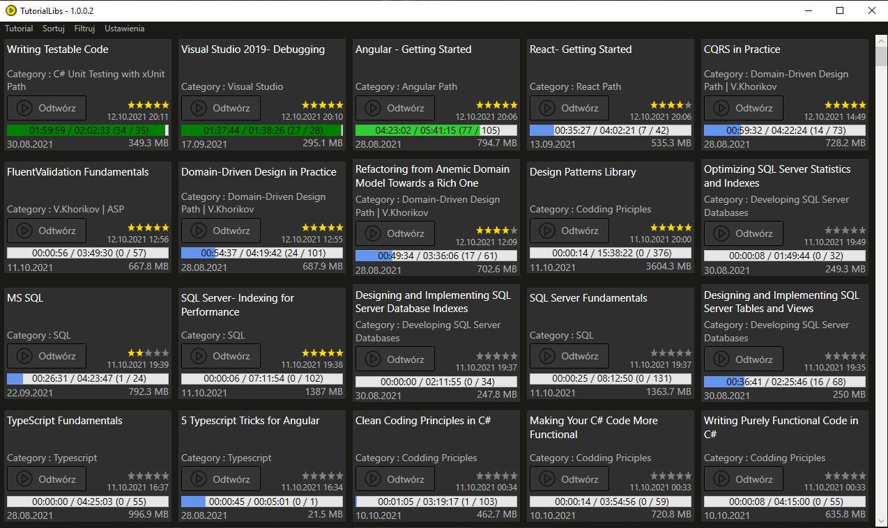

# TutorialsLib

Manage your tutorials library.

## Description

A video player based on VLC Media Player that helps you manage your collection of video courses. 
This is a WPF application.

## Screenshots

## Getting Started

### Installing

* No need to be installed.

### Executing program

* Just run TutorialLibs.exe

## Version History

* 0.1
    * Initial Release

## License

This project is licensed under the GPLv3 License

## Libraries Used
* [LibVLCSharp](https://github.com/videolan/libvlcsharp)
* [vlc](https://github.com/videolan/vlc)
* [MediaInfo](https://github.com/MediaArea/MediaInfo)
* [Prism](https://github.com/PrismLibrary/Prism)
* [SQLite](https://github.com/sqlite/sqlite)
